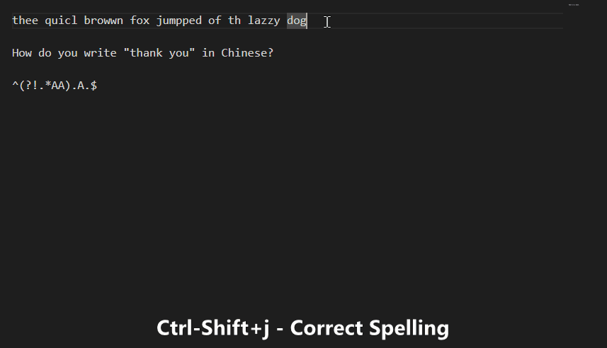

# AI-Tools-AHK

  

### Table of Contents

- [What's this?](#whats-this)  
- [Installation](#installation)  
- [Usage](#usage)  
- [Options](#options)  
- [Credits](#credits)  
&nbsp;

## What's this?  

This is a Windows tool that enables running custom OpenAI prompts on text in any window using global hotkeys.

**Where can it be used?**  

Almost anywhere in Windows where you can enter text.
&nbsp;  

## Installation  

To get started, first download and extract the [latest release](https://github.com/ecornell/ai-tools-ahk/releases) .zip file. If you already have [AutoHotkey](https://www.autohotkey.com) installed, simply run `AI-Tools.ahk`. If not, use the .exe version, which allows you to use the script without having AutoHotkey installed. The script doesn't install anything and is portable, so you can run it from any location. 

When you run the script for the first time, it will create a new `settings.ini` file in the same directory. This file contains the script's settings, which you can edit to change the hotkeys or add your own prompts. 

Additionally, the script will prompt you to enter your OpenAI API key. If you don't have one yet, you can obtain an API key from [OpenAI](https://platform.openai.com/).

## Usage

The default hotkeys and prompts are set to the following:

`Ctrl+Shift+j` - (Auto-select text - Fix spelling) - Auto selects the current line or paragraph and runs the "Fix Spelling" prompt and replaces it with the corrected version.

`Ctrl+Shift+k` - (Auto-select text - Prompt Menu) - Auto selects the current line or paragraph and opens the prompt menu.

`Ctrl+Alt+Shift+k` - (Manual-select text - Prompt Menu) - Opens the prompt menu to pick the prompt to run on the selected text.

### How does it work?

## Options

The `settings.ini` file contains the settings for the script. You can edit this file to change the prompts, the API mode and model to use, and individual model settings.

**Start with windows**  

To have the script start when windows boots up, select "Start With Windows" from the tray icon.  
&nbsp;

## Supported APIs and Models
OpenAI 

    /v1/chat/completions (Default) - gpt-3.5-turbo
    /v1/completions - text-davinci-003
    /v1/edits - text-davinci-edit-001

Azure 

    /openai/deployments/***/completions - text-davinci-003

## Credits

TheArkive (JXON_ahk2) and the AHK community.

